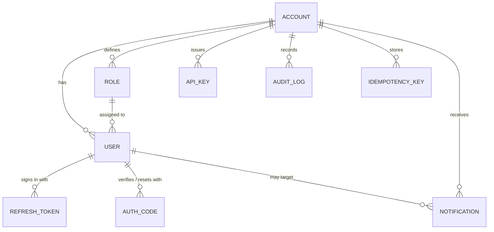
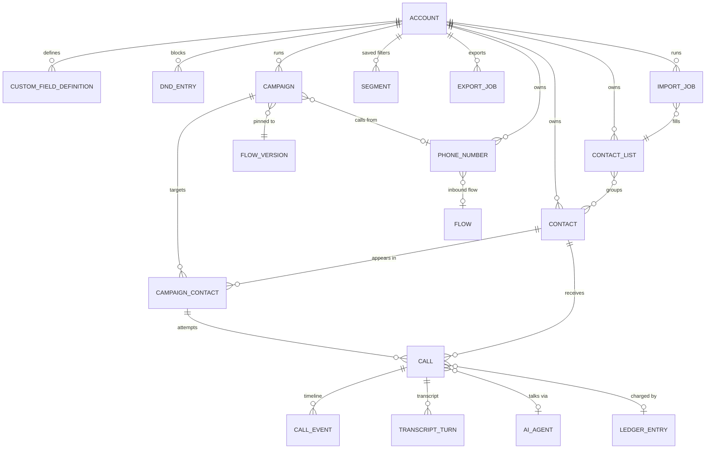
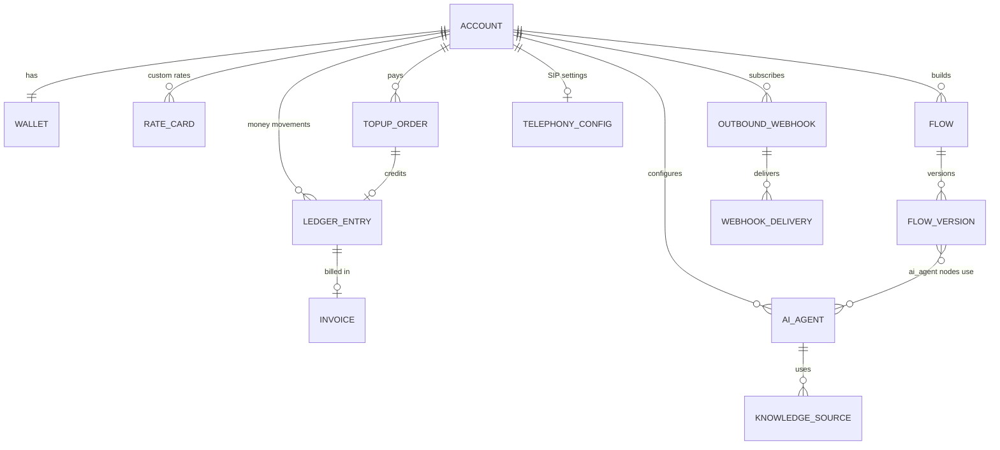

# Core Data Model (draft)

Design draft of every MongoDB collection planned for Phases 1–14. Mongoose models are written phase by phase from this document; when a model deviates, update this file in the same PR.

Rules that apply to every entity are in [data.md](data.md): camelCase fields, `accountId` on every tenant document (first field in compound indexes), `createdAt` / `updatedAt` timestamps, money as `*Micros`, phones as E.164, enums lower_snake_case.

Legend for field tables: **R** = required. All tenant collections also have `_id`, `accountId` (R, indexed), `createdAt`, `updatedAt` — not repeated in every table.

---

## 1. Diagrams

### 1a. Tenancy & auth

### 1b. Contacts, campaigns & calls

### 1c. Wallet, AI, flows & integrations

---

## 2. Entities

### 2.1 Tenancy & auth

#### Account (`accounts`) — Phase 2

Not tenant-scoped (it **is** the tenant): no `accountId`.

| Field                        | Type                                               | R   | Notes                                                                               |
| ---------------------------- | -------------------------------------------------- | --- | ----------------------------------------------------------------------------------- |
| name                         | string                                             | ✓   | Business name                                                                       |
| slug                         | string                                             | ✓   | Unique, URL-safe                                                                    |
| status                       | `active \| suspended`                              | ✓   | Suspended → no calls, read-only                                                     |
| timezone                     | string                                             | ✓   | IANA, default `Asia/Kolkata`                                                        |
| country                      | string                                             | ✓   | ISO-3166 alpha-2, default `IN`                                                      |
| defaultLanguage              | `hi \| en \| hinglish`                             | ✓   | Default for flows/agents                                                            |
| settings.callingWindow       | `{ start: "09:00", end: "19:00", days: number[] }` | ✓   | Account default; campaigns may narrow it                                            |
| settings.recordingEnabled    | boolean                                            | ✓   | Default true                                                                        |
| settings.aiDisclosureEnabled | boolean                                            | ✓   | Default true (compliance)                                                           |
| ownerId                      | ObjectId → users                                   |     | The single owner (set at signup)                                                    |
| suspendedAt, suspendReason   | Date, string                                       |     | Set by a superadmin                                                                 |
| isPlatform                   | boolean                                            | ✓   | `true` only for the internal `platform` account (holds superadmins; migration 0002) |

Indexes: `{ slug: 1 }` unique, `{ status: 1 }`. Slugs `platform`, `admin`, `api`, `www`, `app`, `support` are reserved. Defaults: timezone `Asia/Kolkata`, country `IN`, language `hinglish`, calling window 09:00–19:00 Mon–Sat. PII: none. Retention: life of contract.

#### User (`users`) — Phase 2

| Field             | Type                                                      | R   | Notes                                                                                      |
| ----------------- | --------------------------------------------------------- | --- | ------------------------------------------------------------------------------------------ |
| name              | string                                                    | ✓   |                                                                                            |
| email             | string                                                    | ✓   | Lowercase, **unique globally**                                                             |
| phone             | string                                                    |     | E.164                                                                                      |
| passwordHash      | string                                                    |     | Null for invited-not-yet-accepted                                                          |
| roleId            | ObjectId → roles                                          | ✓   |                                                                                            |
| status            | `invited \| active \| disabled`                           | ✓   |                                                                                            |
| lastLoginAt       | Date                                                      |     |                                                                                            |
| emailVerifiedAt   | Date                                                      |     | Set by the signup OTP / invite acceptance                                                  |
| tokenVersion      | number                                                    | ✓   | Bumped to invalidate all access tokens (password change, disable, role change, logout-all) |
| platformRole      | `superadmin \| null`                                      |     | Platform admins only (in the `platform` account, created by `npm run superadmin:create`)   |
| invite            | `{ tokenHash, expiresAt, invitedBy, lastSentAt } \| null` |     | Pending invitation (status `invited`)                                                      |
| passwordChangedAt | Date                                                      |     |                                                                                            |
| deletedAt         | Date \| null                                              |     | Soft delete                                                                                |

Indexes: `{ email: 1 }` unique **partial** (`deletedAt: null` — a removed user's email can be invited again), `{ accountId: 1, status: 1 }`, `{ 'invite.tokenHash': 1 }` sparse. JSON never contains `passwordHash`, `tokenVersion`, `invite`. PII: email, phone, name.

#### Role (`roles`) — Phase 2

| Field       | Type     | R   | Notes                                                                                  |
| ----------- | -------- | --- | -------------------------------------------------------------------------------------- |
| key         | string   | ✓   | `owner \| admin \| manager \| agent \| viewer` (custom keys later); unique per account |
| name        | string   | ✓   | Display name                                                                           |
| permissions | string[] | ✓   | e.g. `campaigns.write`, `wallet.topup`                                                 |
| isSystem    | boolean  | ✓   | Built-in owner/admin/manager/agent/viewer (not deletable)                              |

Indexes: `{ accountId: 1, key: 1 }` unique. Permissions come from the catalogue `src/modules/rbac/permissions.ts`; system roles are synced from `SYSTEM_ROLES` (signup + migrations).

#### RefreshToken (`refreshTokens`) — Phase 2

| Field         | Type             | R   | Notes                                                                                                             |
| ------------- | ---------------- | --- | ----------------------------------------------------------------------------------------------------------------- |
| userId        | ObjectId → users | ✓   |                                                                                                                   |
| familyId      | string           | ✓   | Rotation family — reuse of a rotated token revokes the family                                                     |
| tokenHash     | string           | ✓   | Never the raw token                                                                                               |
| expiresAt     | Date             | ✓   | **TTL index**                                                                                                     |
| revokedAt     | Date             |     |                                                                                                                   |
| replacedBy    | ObjectId         |     | Next token in the family                                                                                          |
| userAgent, ip | string           |     | Session list in UI                                                                                                |
| accountId     | ObjectId         | ✓   | Account of the session                                                                                            |
| revokedReason | string           |     | `logout \| logout_all \| rotated \| reuse_detected \| password_changed \| disabled \| removed \| session_revoked` |
| lastUsedAt    | Date             | ✓   |                                                                                                                   |

Indexes: `{ tokenHash: 1 }` unique, `{ userId: 1, familyId: 1 }`, `{ expiresAt: 1 }` TTL (0 s). `tokenHash` = HMAC-SHA256(`JWT_REFRESH_SECRET`, raw token).

#### AuthCode (`authCodes`) — Phase 2

One live code per user and purpose (email OTP or password-reset token), hashed.

| Field                                  | Type                             | R   | Notes                                   |
| -------------------------------------- | -------------------------------- | --- | --------------------------------------- |
| userId                                 | ObjectId → users                 | ✓   |                                         |
| purpose                                | `verify_email \| reset_password` | ✓   |                                         |
| codeHash                               | string                           | ✓   | HMAC of the code / token                |
| attempts                               | number                           | ✓   | Wrong tries (max 5 for OTPs)            |
| sentCount, sendWindowStart, lastSentAt | number, Date, Date               | ✓   | Resend cooldown (60 s) + hourly cap (5) |
| expiresAt                              | Date                             | ✓   | **TTL** — OTP 10 min, reset 30 min      |
| usedAt                                 | Date                             |     | Single use                              |

Indexes: `{ userId: 1, purpose: 1 }` unique, `{ codeHash: 1 }`, `{ expiresAt: 1 }` TTL. Not tenant-scoped (looked up before login).

#### ApiKey (`apiKeys`) — Phase 2/10

| Field      | Type             | R   | Notes                                       |
| ---------- | ---------------- | --- | ------------------------------------------- |
| name       | string           | ✓   |                                             |
| prefix     | string           | ✓   | First chars, shown in UI (`cav_live_ab12…`) |
| keyHash    | string           | ✓   | SHA-256 of the full key; raw key shown once |
| scopes     | string[]         | ✓   | `calls:write`, `contacts:write`, …          |
| lastUsedAt | Date             |     |                                             |
| revokedAt  | Date             |     |                                             |
| createdBy  | ObjectId → users | ✓   |                                             |

Indexes: `{ keyHash: 1 }` unique, `{ accountId: 1, revokedAt: 1 }`.

#### AuditLog (`auditLogs`) — Phase 2

| Field  | Type                                                                  | R   | Notes                                                                            |
| ------ | --------------------------------------------------------------------- | --- | -------------------------------------------------------------------------------- |
| actor  | `{ type: user \| api_key \| system, id, impersonatorId?, platform? }` | ✓   | `impersonatorId` = superadmin acting as the user; `platform` = superadmin action |
| action | string                                                                | ✓   | `campaign.started`, `wallet.adjusted`, …                                         |
| target | `{ type, id }`                                                        |     |                                                                                  |
| meta   | object                                                                |     | No PII values                                                                    |
| ip     | string                                                                |     |                                                                                  |
| at     | Date                                                                  | ✓   |                                                                                  |

Indexes: `{ accountId: 1, at: -1 }`, `{ accountId: 1, action: 1, at: -1 }`. **Immutable** (model hooks reject updates / deletes; only the purge job deletes with `allowPurge`). Action catalogue: [audit.md](audit.md) (Phase 2 · T2.10). Retention: 1 year (purge job).

#### IdempotencyKey (`idempotencyKeys`) — Phase 1

| Field          | Type                       | R   | Notes                           |
| -------------- | -------------------------- | --- | ------------------------------- |
| key            | string                     | ✓   | Client `Idempotency-Key` header |
| method, path   | string                     | ✓   |                                 |
| requestHash    | string                     | ✓   | SHA-256 of the body             |
| status         | `in_progress \| completed` | ✓   |                                 |
| responseStatus | number                     |     |                                 |
| responseBody   | object                     |     | Replayed on retry               |
| expiresAt      | Date                       | ✓   | **TTL**, 24 h                   |

Indexes: `{ accountId: 1, key: 1 }` unique, `{ expiresAt: 1 }` TTL.

#### Notification (`notifications`) — Phase 4

| Field       | Type             | R   | Notes                                                                                         |
| ----------- | ---------------- | --- | --------------------------------------------------------------------------------------------- |
| userId      | ObjectId → users | ✓   | **One row per recipient** (fan-out at creation, so each user has their own read state)        |
| type        | string           | ✓   | `wallet.low_balance`, `wallet.exhausted`, `wallet.topup_paid`, `wallet.adjusted`, `billing.*` |
| title, body | string           | ✓   | ≤ 120 / ≤ 500                                                                                 |
| link        | string           |     | In-app route                                                                                  |
| readAt      | Date             |     |                                                                                               |
| expiresAt   | Date             | ✓   | **TTL** (90 days), hidden                                                                     |

Indexes: `{ accountId: 1, userId: 1, readAt: 1, createdAt: -1 }`, `{ expiresAt: 1 }` TTL. Recipients of account-wide notices are resolved server-side by permission (e.g. users with `wallet.read`).

### 2.2 Contacts

Phase 3 ([PHASE_3_PLAN.md](../phases/PHASE_3_PLAN.md) §1). All collections are tenant-scoped (`accountId`, indexed).

#### Contact (`contacts`) — Phase 3

| Field        | Type                                              | R   | Notes                                                                                                                                            |
| ------------ | ------------------------------------------------- | --- | ------------------------------------------------------------------------------------------------------------------------------------------------ |
| phoneE164    | string                                            | ✓   | Unique per account among live contacts (ADR 0018)                                                                                                |
| name         | string \| null                                    |     | ≤ 120, Unicode                                                                                                                                   |
| email        | string \| null                                    |     | lower-case                                                                                                                                       |
| externalId   | string \| null                                    |     | Client's loan / CRM id — unique per account when set                                                                                             |
| variables    | `Map<key, string \| number>`                      | ✓   | Typed by `customFieldDefinitions`: text / phone / date (`YYYY-MM-DD`) as string, number as number, **currency as integer micros**. Sensitive PII |
| tags         | string[]                                          | ✓   | lower-case, ≤ 20; no Tag collection                                                                                                              |
| listIds      | ObjectId[] → contactLists                         | ✓   | ≤ 50                                                                                                                                             |
| dnd          | boolean                                           | ✓   | Mirrors `dndEntries` for fast filtering                                                                                                          |
| optedOutAt   | Date \| null                                      |     | Opt-out also creates a DND entry                                                                                                                 |
| consent      | `{ source, at }` \| null                          |     | Compliance (T0.18)                                                                                                                               |
| source       | `{ type: manual \| import \| api, importJobId? }` | ✓   | First creation                                                                                                                                   |
| searchText   | string                                            | ✓   | lower-case name + email + phone digits + externalId; **never serialised**                                                                        |
| lastCalledAt | Date \| null                                      |     | Call caps (Phase 8)                                                                                                                              |
| callCount    | number                                            | ✓   | Phase 8                                                                                                                                          |
| deletedAt    | Date \| null                                      |     | Soft delete; re-creating the phone revives the document; hard-deleted after 30 days                                                              |

Indexes: `{ accountId, phoneE164 }` unique partial (`deletedAt: null`), `{ accountId, externalId }` unique partial (string, live), `{ accountId, deletedAt, createdAt: -1 }`, `{ accountId, listIds }`, `{ accountId, tags }`, `{ accountId, dnd }`, `{ accountId, name }` (collation `en`, strength 2). PII: phone, name, email, variables, searchText. Retention: until deleted by the client (+ 30-day purge of soft-deleted contacts).

#### ContactList (`contactLists`) — Phase 3

| Field       | Type                                           | R   | Notes                                       |
| ----------- | ---------------------------------------------- | --- | ------------------------------------------- |
| name        | string                                         | ✓   | Unique per account (case-insensitive, live) |
| description | string \| null                                 |     |                                             |
| source      | `{ type: upload \| api \| manual, fileName? }` | ✓   |                                             |
| deletedAt   | Date \| null                                   |     | Soft delete; members keep their contacts    |

Indexes: `{ accountId, name }` unique partial (collation `en` / 2). **No stored counter** — counts are computed on read (no drift).

#### CustomFieldDefinition (`customFieldDefinitions`) — Phase 3

| Field        | Type                                          | R   | Notes                                                                       |
| ------------ | --------------------------------------------- | --- | --------------------------------------------------------------------------- |
| key          | string                                        | ✓   | `^[a-z][a-z0-9_]{0,39}$`, unique per account, immutable; `{{key}}` in flows |
| label        | string                                        | ✓   |                                                                             |
| type         | `text \| number \| date \| currency \| phone` | ✓   | Changeable only while no contact has a value                                |
| required     | boolean                                       | ✓   |                                                                             |
| defaultValue | string \| number \| null                      |     | Stored form (currency micros, date `YYYY-MM-DD`)                            |
| order        | number                                        | ✓   | Display order                                                               |

Indexes: `{ accountId, key }` unique, `{ accountId, order }`. Max 50 per account.

#### Segment (`segments`) — Phase 3

| Field     | Type             | R   | Notes                                 |
| --------- | ---------------- | --- | ------------------------------------- |
| name      | string           | ✓   | Unique per account (case-insensitive) |
| filter    | `ContactFilter`  | ✓   | Evaluated at query time               |
| createdBy | ObjectId → users | ✓   |                                       |

Indexes: `{ accountId, name }` unique (collation `en` / 2). Max 100 per account.

#### DndEntry (`dndEntries`) — Phase 3

| Field     | Type                                  | R   | Notes                   |
| --------- | ------------------------------------- | --- | ----------------------- |
| phoneE164 | string                                | ✓   | Unique per account      |
| reason    | string \| null                        |     |                         |
| source    | `manual \| upload \| keyword \| dtmf` | ✓   | e.g. customer pressed 9 |
| addedBy   | ObjectId → users \| null              |     |                         |

Indexes: `{ accountId, phoneE164 }` unique, `{ accountId, createdAt: -1 }`. PII: phone.

#### ImportJob (`importJobs`) — Phase 3

| Field                                                       | Type                                                                                            | R   | Notes                                     |
| ----------------------------------------------------------- | ----------------------------------------------------------------------------------------------- | --- | ----------------------------------------- |
| kind                                                        | `contacts \| dnd`                                                                               | ✓   |                                           |
| fileName, fileType, fileSize                                | string, `csv \| xlsx`, number                                                                   | ✓   |                                           |
| fileKey                                                     | string \| null                                                                                  |     | Storage key (hidden); cleared when purged |
| sheet, sheets                                               | string, string[]                                                                                |     | xlsx only                                 |
| columns                                                     | `[{ index, header, samples[] }]`                                                                | ✓   | Samples are PII — purged with the file    |
| rowCount                                                    | number                                                                                          | ✓   |                                           |
| mapping, options                                            | object                                                                                          |     | Validated by the contact-imports module   |
| status                                                      | `uploaded \| mapped \| validating \| validated \| importing \| completed \| failed \| canceled` | ✓   |                                           |
| progress                                                    | `{ processed, total }`                                                                          | ✓   | Checkpoint for resume                     |
| totals                                                      | `{ rows, created, updated, unchanged, invalid, duplicates, dnd }`                               | ✓   |                                           |
| problemRows                                                 | `[{ row, reasons[] }]`                                                                          | ✓   | ≤ 100, **no cell values**                 |
| errorReportKey                                              | string \| null                                                                                  |     | Error CSV in storage (hidden)             |
| listId                                                      | ObjectId \| null                                                                                |     | Target list                               |
| warnings, errorMessage                                      | string[], string                                                                                |     | No PII                                    |
| cancelRequested                                             | boolean                                                                                         | ✓   | Hidden                                    |
| createdBy                                                   | ObjectId → users                                                                                | ✓   |                                           |
| startedAt, completedAt, failedAt, canceledAt, filesPurgedAt | Date                                                                                            |     |                                           |

Indexes: `{ accountId, createdAt: -1 }`, `{ status, completedAt }`. Retention: file + error report + samples deleted 30 days after the job ends; the document (totals) stays.

#### ExportJob (`exportJobs`) — Phase 3

| Field                  | Type                                                  | R   | Notes                              |
| ---------------------- | ----------------------------------------------------- | --- | ---------------------------------- |
| scope                  | `ids \| filter \| list \| segment`                    | ✓   |                                    |
| filter                 | `ContactFilter`                                       | ✓   | Resolved at creation               |
| columns                | string[]                                              | ✓   |                                    |
| status                 | `pending \| processing \| ready \| failed \| expired` | ✓   |                                    |
| progress               | `{ processed, total }`                                | ✓   |                                    |
| rowCount               | number                                                | ✓   |                                    |
| fileKey                | string \| null                                        |     | Hidden; CSV with PII               |
| createdBy              | ObjectId → users                                      | ✓   |                                    |
| completedAt, expiresAt | Date                                                  |     | File deleted at `expiresAt` (24 h) |

Indexes: `{ accountId, createdAt: -1 }`, `{ status, expiresAt }`.

### 2.3 Wallet & billing

Money is integer **micros** (₹1 = 1,000,000 — ADR 0016), percentages are **basis points** (1 % = 100 bps). All writes go through `src/core/billing/engine.ts` in one transaction with their ledger rows (ADR 0032).

#### Wallet (`wallets`) — Phase 4

| Field                     | Type                                                    | R   | Notes                                                                    |
| ------------------------- | ------------------------------------------------------- | --- | ------------------------------------------------------------------------ |
| accountId                 | ObjectId → accounts                                     | ✓   | **Unique** — one wallet per account (created at signup / migration 0005) |
| currency                  | `INR`                                                   | ✓   |                                                                          |
| balanceMicros             | number                                                  | ✓   | Real money; below 0 only after a call overran its hold                   |
| holdMicros                | number                                                  | ✓   | Reserved for running calls (≥ 0)                                         |
| creditLimitMicros         | number                                                  | ✓   | Default 0; holds may use it, AI / TTS charges never                      |
| lowBalanceThresholdMicros | number                                                  | ✓   | Default ₹500; 0 = alerts off                                             |
| budgets                   | `{ monthlyCallMicros, monthlyAiMicros }`                | ✓   | 0 = unlimited                                                            |
| spend                     | `{ month: 'YYYY-MM', callMicros, aiMicros, ttsMicros }` | ✓   | Month in the account timezone; reset when a new month starts             |
| alerts                    | `{ lowBalanceNotifiedAt, exhaustedNotifiedAt }`         | ✓   | Hidden — once-per-24 h alert claims                                      |
| version                   | number                                                  | ✓   | Hidden — bumped on every change                                          |

Derived in the API: `availableMicros = balance + creditLimit − hold`, `status` `ok | low | exhausted`.

#### LedgerEntry (`ledgerEntries`) — Phase 4 — **insert-only**

| Field                     | Type                                                                                                                                    | R   | Notes                                                      |
| ------------------------- | --------------------------------------------------------------------------------------------------------------------------------------- | --- | ---------------------------------------------------------- |
| type                      | `topup \| call_charge \| ai_charge \| tts_charge \| adjustment \| refund \| subscription \| recording_charge`                           | ✓   |                                                            |
| direction                 | `credit \| debit`                                                                                                                       | ✓   |                                                            |
| status                    | `held \| captured \| released`                                                                                                          | ✓   | **Only allowed mutation: `held → released`** (model guard) |
| amountMicros              | number                                                                                                                                  | ✓   | > 0, never changes                                         |
| currency                  | `INR`                                                                                                                                   | ✓   |                                                            |
| balanceAfterMicros        | number                                                                                                                                  |     | Wallet balance right after a captured row                  |
| breakdown                 | `{ telephonyMicros, aiMicros, ttsMicros, commissionMicros, answered, durationSec, billableSeconds, pulseSeconds, aiSeconds, ttsChars }` |     | Call / usage charges                                       |
| ref                       | `{ type: call \| campaign \| topup \| manual \| simulator \| usage \| seed, id }`                                                       | ✓   |                                                            |
| holdId                    | ObjectId → ledgerEntries                                                                                                                |     | Charge → its hold; extension hold → the first hold row     |
| rateCardId                | ObjectId → rateCards                                                                                                                    |     | Prices used (snapshot reference)                           |
| idempotencyKey            | string                                                                                                                                  | ✓   | Unique per account, hidden — repeats return the stored row |
| note                      | string                                                                                                                                  |     | Adjustment reason                                          |
| createdBy                 | ObjectId → users                                                                                                                        |     | Null for system                                            |
| releasedAt, releaseReason | Date, string                                                                                                                            |     | Set by the release                                         |

A call settle = release the hold rows + insert a `captured` charge row (amounts are never edited). Indexes: `{ accountId: 1, idempotencyKey: 1 }` unique, `{ accountId: 1, createdAt: -1, _id: -1 }`, `{ accountId: 1, ref.type: 1, ref.id: 1 }`, `{ status: 1, createdAt: 1 }` (reaper), `{ holdId: 1 }`. Retention: forever (financial record).

#### RateCard (`rateCards`) — Phase 4

| Field                  | Type             | R   | Notes                                                      |
| ---------------------- | ---------------- | --- | ---------------------------------------------------------- |
| accountId              | ObjectId \| null |     | **Null = platform default** (exception to the tenant rule) |
| callPerMinuteMicros    | number           | ✓   | Selling price per call minute                              |
| pulseSeconds           | `15 \| 30 \| 60` | ✓   | Billing rounding of answered calls                         |
| aiPerMinuteMicros      | number           | ✓   | Billed per second of AI use                                |
| ttsPer1kCharsMicros    | number           | ✓   |                                                            |
| commissionBps          | number           | ✓   | 0–10,000                                                   |
| billUnansweredAttempts | boolean          | ✓   | Default false                                              |
| inheritsDefault        | boolean          | ✓   | Account row meaning "use the platform default again"       |
| effectiveFrom          | Date             | ✓   | Insert-only history; latest `effectiveFrom ≤ now` wins     |
| createdBy, note        | ObjectId, string |     |                                                            |

Indexes: `{ accountId: 1, effectiveFrom: -1 }`. Migration 0005 inserts the platform default.

#### TopupOrder (`topupOrders`) — Phase 4

| Field                                                                  | Type                                                           | R   | Notes                                          |
| ---------------------------------------------------------------------- | -------------------------------------------------------------- | --- | ---------------------------------------------- |
| provider                                                               | `razorpay \| fake`                                             | ✓   | `fake` only outside production                 |
| providerOrderId, providerPaymentId                                     | string                                                         |     | Unique per provider when set (partial indexes) |
| baseMicros, cgstMicros, sgstMicros, igstMicros, taxMicros, totalMicros | number                                                         | ✓   | Base credited to the wallet; GST on top        |
| status                                                                 | `creating \| created \| paid \| failed \| expired \| refunded` | ✓   |                                                |
| failureReason                                                          | string                                                         |     |                                                |
| buyer                                                                  | billing profile snapshot                                       | ✓   | Invoice buyer                                  |
| createdBy                                                              | ObjectId → users                                               | ✓   |                                                |
| paidAt, ledgerEntryId, invoiceId                                       |                                                                |     | Set when credited                              |
| rawProviderStatus                                                      | string                                                         |     | Hidden                                         |

Indexes: `{ provider, providerOrderId }` / `{ provider, providerPaymentId }` unique partial, `{ accountId: 1, createdAt: -1 }`, `{ status: 1, createdAt: 1 }`. Retention: forever.

#### Invoice (`invoices`) — Phase 4

| Field         | Type                                                                         | R   | Notes                                        |
| ------------- | ---------------------------------------------------------------------------- | --- | -------------------------------------------- |
| number        | string                                                                       | ✓   | `CAV/26-27/000001`, unique, ≤ 16 chars (GST) |
| fy            | string                                                                       | ✓   | Indian financial year (IST), `26-27`         |
| topupOrderId  | ObjectId                                                                     | ✓   | Unique                                       |
| ledgerEntryId | ObjectId                                                                     | ✓   |                                              |
| seller        | `{ name, address, gstin, stateCode }`                                        | ✓   | Snapshot from env                            |
| buyer         | billing profile snapshot                                                     | ✓   |                                              |
| placeOfSupply | `{ stateCode, stateName }`                                                   | ✓   |                                              |
| sacCode       | string                                                                       | ✓   |                                              |
| amounts       | `{ baseMicros, cgstMicros, sgstMicros, igstMicros, taxMicros, totalMicros }` | ✓   | CGST + SGST (same state) or IGST             |
| paymentId     | string                                                                       | ✓   |                                              |
| issuedAt      | Date                                                                         | ✓   |                                              |
| status        | `rendering \| ready \| failed`                                               | ✓   | PDF rendered by a job                        |
| pdfFileKey    | string                                                                       |     | Hidden; download via signed URL              |

Indexes: `{ number: 1 }` unique, `{ topupOrderId: 1 }` unique, `{ accountId: 1, createdAt: -1 }`. Retention: 8 years (tax records — confirm with CA).

#### InvoiceCounter (`invoiceCounters`) — Phase 4

`{ _id: '<fy>', seq }` — `$inc` inside the credit transaction (consecutive numbers, an aborted transaction consumes none). Platform-wide (one GST series per seller).

#### PaymentEvent (`paymentEvents`) — Phase 4

Provider webhook deliveries: `provider`, `eventId` (unique per provider), `type`, `accountId?`, `topupOrderId?`, `providerOrderId?`, `providerPaymentId?`, `outcome` (`received \| credited \| duplicate_credit \| failed \| unmatched \| mismatch \| refund \| ignored`), `receivedAt`, `processedAt`, `expiresAt` (TTL 90 days).

#### Account billing profile (`accounts.billing`) — Phase 4

`{ legalName, email, addressLine1, addressLine2?, city, stateCode, pin, gstin?, updatedAt }` — Latin text only (the invoice PDF can't shape Devanagari); GSTIN checksum + state validated by the API.

### 2.4 AI & flows

#### AiAgent (`aiAgents`) — Phase 5

| Field                             | Type                                     | R   | Notes                                                                                                          |
| --------------------------------- | ---------------------------------------- | --- | -------------------------------------------------------------------------------------------------------------- |
| name                              | string                                   | ✓   |                                                                                                                |
| provider                          | `openai_realtime`                        | ✓   | ADR 0021                                                                                                       |
| model, voice                      | string                                   | ✓   |                                                                                                                |
| languageMode                      | `auto \| hi \| en \| hinglish`           | ✓   |                                                                                                                |
| systemPrompt                      | string                                   | ✓   |                                                                                                                |
| openingLine, closingLine          | string                                   |     | Support `{{variables}}`                                                                                        |
| toneRules                         | string                                   |     |                                                                                                                |
| temperature                       | number                                   | ✓   |                                                                                                                |
| maxCallSeconds, silenceTimeoutSec | number                                   | ✓   |                                                                                                                |
| bargeIn                           | boolean                                  | ✓   |                                                                                                                |
| functions                         | AgentFunction[] (embedded)               | ✓   | `{ name, description, parametersSchema, http: { method, url, headers, bodyTemplate, resultPath, timeoutMs } }` |
| builtInTools                      | string[]                                 | ✓   | `end_call`, `transfer_to_human`, `set_disposition`, `schedule_callback`, …                                     |
| knowledgeSourceIds                | ObjectId[]                               | ✓   |                                                                                                                |
| limits                            | `{ dailyMicros, monthlyMicros }`         | ✓   |                                                                                                                |
| fallbackMessages                  | `{ aiFailed, walletEmpty, unavailable }` | ✓   |                                                                                                                |
| status                            | `active \| inactive`                     | ✓   |                                                                                                                |
| deletedAt                         | Date \| null                             |     |                                                                                                                |

Indexes: `{ accountId: 1, deletedAt: 1, name: 1 }`. Secrets in function headers → encrypted (Phase 5 decision).

#### KnowledgeSource (`knowledgeSources`) — Phase 5

| Field         | Type                                       | R   | Notes                                          |
| ------------- | ------------------------------------------ | --- | ---------------------------------------------- |
| agentId       | ObjectId → aiAgents                        | ✓   |                                                |
| type          | `file \| url`                              | ✓   |                                                |
| name          | string                                     | ✓   |                                                |
| fileKey / url | string                                     | ✓   |                                                |
| status        | `pending \| processing \| ready \| failed` | ✓   |                                                |
| chunkCount    | number                                     | ✓   |                                                |
| vectorRef     | string                                     |     | Depends on vector store choice (open question) |

Indexes: `{ accountId: 1, agentId: 1 }`.

#### Flow (`flows`) — Phase 6

| Field              | Type                             | R   | Notes            |
| ------------------ | -------------------------------- | --- | ---------------- |
| name, description  | string                           | ✓ / |                  |
| status             | `draft \| published \| archived` | ✓   |                  |
| draftVersionId     | ObjectId → flowVersions          |     | Editable version |
| publishedVersionId | ObjectId → flowVersions          |     | Live version     |
| deletedAt          | Date \| null                     |     |                  |

Indexes: `{ accountId: 1, deletedAt: 1, updatedAt: -1 }`.

#### FlowVersion (`flowVersions`) — Phase 6 — **published = immutable**

| Field           | Type             | R   | Notes                            |
| --------------- | ---------------- | --- | -------------------------------- |
| flowId          | ObjectId → flows | ✓   |                                  |
| version         | number           | ✓   | Unique per flow                  |
| nodes           | Node[]           | ✓   | `{ id, type, position, config }` |
| edges           | Edge[]           | ✓   | `{ id, from, to, condition? }`   |
| variablesSchema | object           |     | Variables the flow expects       |
| createdBy       | ObjectId → users | ✓   |                                  |
| publishedAt     | Date             |     | Set once                         |

Indexes: `{ flowId: 1, version: 1 }` unique. Size: a flow graph is bounded (hundreds of nodes max) → embedded arrays are fine.

### 2.5 Campaigns & calls

#### Campaign (`campaigns`) — Phase 8

| Field               | Type                                                                           | R   | Notes                                                                  |
| ------------------- | ------------------------------------------------------------------------------ | --- | ---------------------------------------------------------------------- |
| name                | string                                                                         | ✓   |                                                                        |
| flowId              | ObjectId → flows                                                               | ✓   |                                                                        |
| flowVersionId       | ObjectId → flowVersions                                                        | ✓   | **Pinned at start** — later flow edits don't affect a running campaign |
| audience            | `{ listIds: ObjectId[], segment?: object }`                                    | ✓   |                                                                        |
| callerNumberId      | ObjectId → phoneNumbers                                                        |     | SIP phase                                                              |
| schedule            | `{ startAt, timezone, recurrence? }`                                           | ✓   |                                                                        |
| window              | `{ start, end, days }`                                                         | ✓   | Within the account window                                              |
| retry               | `{ maxAttempts, intervalMinutes, retryOn: (busy \| no_answer \| failed)[] }`   | ✓   |                                                                        |
| concurrency         | number                                                                         | ✓   | ≤ trunk limit                                                          |
| status              | `draft \| scheduled \| running \| paused \| completed \| canceled \| failed`   | ✓   |                                                                        |
| stats               | `{ total, pending, queued, calling, completed, failed, skipped, answered, … }` | ✓   | Denormalised counters                                                  |
| estimatedCostMicros | number                                                                         |     | Shown before start                                                     |
| holdLedgerEntryId   | ObjectId → ledgerEntries                                                       |     | Wallet hold                                                            |
| createdBy           | ObjectId → users                                                               | ✓   |                                                                        |
| deletedAt           | Date \| null                                                                   |     |                                                                        |

Indexes: `{ accountId: 1, status: 1, createdAt: -1 }`, `{ status: 1, schedule.startAt: 1 }` (scheduler).

#### CampaignContact (`campaignContacts`) — Phase 8

| Field                | Type                                                             | R   | Notes                                                                |
| -------------------- | ---------------------------------------------------------------- | --- | -------------------------------------------------------------------- |
| campaignId           | ObjectId → campaigns                                             | ✓   |                                                                      |
| contactId            | ObjectId → contacts                                              | ✓   |                                                                      |
| phoneE164, variables | snapshot                                                         | ✓   | Copied at campaign start — later contact edits don't change the call |
| status               | `pending \| queued \| calling \| completed \| failed \| skipped` | ✓   |                                                                      |
| attempts             | number                                                           | ✓   |                                                                      |
| nextAttemptAt        | Date                                                             |     | Retry scheduling                                                     |
| lastCallId           | ObjectId → calls                                                 |     |                                                                      |
| disposition          | string                                                           |     | `paid`, `promise_to_pay`, `wrong_number`, `callback`, …              |
| skipReason           | `dnd \| opted_out \| invalid_phone \| outside_window \| …`       |     |                                                                      |

Indexes: `{ campaignId: 1, contactId: 1 }` unique, `{ campaignId: 1, status: 1, nextAttemptAt: 1 }`. PII: phone, variables snapshot. Retention: with the campaign.

#### Call (`calls`) — Phase 7

| Field                                    | Type                                                                                       | R   | Notes                               |
| ---------------------------------------- | ------------------------------------------------------------------------------------------ | --- | ----------------------------------- |
| direction                                | `outbound \| inbound`                                                                      | ✓   |                                     |
| provider                                 | `webcall \| sip \| notifynow`                                                              | ✓   | ADR 0020                            |
| providerCallId                           | string                                                                                     |     |                                     |
| from, to                                 | string                                                                                     | ✓   | E.164 (webcall: `webcall:<userId>`) |
| contactId, campaignId, campaignContactId | ObjectId                                                                                   |     |                                     |
| flowId, flowVersionId, agentId           | ObjectId                                                                                   |     |                                     |
| status                                   | `queued \| ringing \| in_progress \| completed \| failed \| busy \| no_answer \| canceled` | ✓   |                                     |
| hangupCause                              | string                                                                                     |     | Provider cause mapped               |
| timestamps                               | `{ queuedAt, startedAt, answeredAt, endedAt }`                                             | ✓   |                                     |
| durationSec, billableSec                 | number                                                                                     |     | billableSec after pulse rounding    |
| disposition, sentiment, summary          | string                                                                                     |     | Post-call AI (Phase 9)              |
| languageDetected                         | string                                                                                     |     |                                     |
| recording                                | `{ fileKey, durationSec, sizeBytes, format }`                                              |     | Embedded                            |
| cost                                     | `{ telephonyMicros, aiMicros, ttsMicros, totalMicros }`                                    |     |                                     |
| ledgerEntryId                            | ObjectId                                                                                   |     |                                     |
| variables                                | snapshot                                                                                   |     |                                     |
| error                                    | `{ code, message }`                                                                        |     |                                     |

Indexes: `{ accountId: 1, createdAt: -1 }`, `{ accountId: 1, campaignId: 1, status: 1 }`, `{ accountId: 1, contactId: 1, createdAt: -1 }`, `{ provider: 1, providerCallId: 1 }` unique sparse. PII: from/to, variables, summary. Retention: configurable (default 180 days — confirm, T0.18).

#### CallEvent (`callEvents`) — Phase 7 — **immutable**

| Field  | Type                                                                                                    | R   | Notes              |
| ------ | ------------------------------------------------------------------------------------------------------- | --- | ------------------ |
| callId | ObjectId → calls                                                                                        | ✓   |                    |
| seq    | number                                                                                                  | ✓   | Monotonic per call |
| type   | `status \| node_entered \| node_exited \| dtmf \| ai_function_call \| ai_function_result \| error \| …` | ✓   |                    |
| data   | object                                                                                                  | ✓   |                    |
| at     | Date                                                                                                    | ✓   |                    |

Indexes: `{ callId: 1, seq: 1 }` unique, `{ accountId: 1, at: -1 }`. Retention: same as calls.

#### TranscriptTurn (`transcriptTurns`) — Phase 7

| Field          | Type                       | R   | Notes                    |
| -------------- | -------------------------- | --- | ------------------------ |
| callId         | ObjectId → calls           | ✓   |                          |
| seq            | number                     | ✓   |                          |
| speaker        | `customer \| bot \| agent` | ✓   |                          |
| text           | string                     | ✓   | **PII**                  |
| language       | string                     |     |                          |
| startMs, endMs | number                     |     | Offset from answer       |
| confidence     | number                     |     |                          |
| interrupted    | boolean                    |     | Bot turn cut by barge-in |

Indexes: `{ callId: 1, seq: 1 }` unique. Retention: same as calls.

#### PhoneNumber (`phoneNumbers`) — Phase 13/14

| Field                          | Type                    | R   | Notes               |
| ------------------------------ | ----------------------- | --- | ------------------- |
| e164                           | string                  | ✓   | **Unique globally** |
| provider                       | `sip \| notifynow`      | ✓   |                     |
| capabilities                   | `{ inbound, outbound }` | ✓   |                     |
| inboundFlowId / inboundAgentId | ObjectId                |     | Inbound routing     |
| status                         | `active \| inactive`    | ✓   |                     |
| deletedAt                      | Date \| null            |     |                     |

Indexes: `{ e164: 1 }` unique, `{ accountId: 1 }`.

### 2.6 Integrations

#### TelephonyConfig (`telephonyConfigs`) — Phase 13

| Field            | Type                                                         | R   | Notes                     |
| ---------------- | ------------------------------------------------------------ | --- | ------------------------- |
| provider         | `sip \| notifynow`                                           | ✓   |                           |
| sip              | `{ host, port, transport, username, passwordEnc, callerId }` |     | **passwordEnc encrypted** |
| concurrencyLimit | number                                                       | ✓   | Trunk limit               |
| status           | `active \| inactive`                                         | ✓   |                           |

Indexes: `{ accountId: 1, provider: 1 }` unique.

#### OutboundWebhook (`outboundWebhooks`) — Phase 10

| Field        | Type     | R   | Notes                                 |
| ------------ | -------- | --- | ------------------------------------- |
| url          | string   | ✓   | HTTPS only in production              |
| events       | string[] | ✓   | `call.completed`, …                   |
| secretEnc    | string   | ✓   | Encrypted signing secret              |
| active       | boolean  | ✓   |                                       |
| failureCount | number   | ✓   |                                       |
| disabledAt   | Date     |     | Auto-disabled after repeated failures |

Indexes: `{ accountId: 1, active: 1 }`.

#### WebhookDelivery (`webhookDeliveries`) — Phase 10

| Field                      | Type                             | R   | Notes           |
| -------------------------- | -------------------------------- | --- | --------------- |
| webhookId                  | ObjectId → outboundWebhooks      | ✓   |                 |
| eventId, type              | string                           | ✓   |                 |
| payload                    | object                           | ✓   |                 |
| status                     | `pending \| succeeded \| failed` | ✓   |                 |
| attempts                   | number                           | ✓   |                 |
| nextAttemptAt              | Date                             |     |                 |
| responseStatus, durationMs | number                           |     |                 |
| expiresAt                  | Date                             | ✓   | **TTL** 30 days |

Indexes: `{ webhookId: 1, createdAt: -1 }`, `{ status: 1, nextAttemptAt: 1 }`, `{ expiresAt: 1 }` TTL.

---

## 3. Embedded vs separate collection

| Data               | Decision                    | Why                                            |
| ------------------ | --------------------------- | ---------------------------------------------- |
| Agent functions    | Embedded in `aiAgents`      | Small, always edited together                  |
| Recording metadata | Embedded in `calls`         | One per call                                   |
| Transcript turns   | Separate `transcriptTurns`  | Unbounded; streamed live                       |
| Call events        | Separate `callEvents`       | Unbounded; append-only                         |
| Campaign audience  | Separate `campaignContacts` | Thousands per campaign; per-row status updates |
| Tags               | Strings on `contacts`       | No metadata needed                             |
| Flow versions      | Separate `flowVersions`     | Immutable history; campaigns pin a version     |
| Flow nodes/edges   | Embedded in a version       | Bounded graph, loaded together                 |
| Wallet budgets     | Embedded in `wallets`       | One wallet per account                         |

## 4. Open questions

1. **Vector store** for knowledge bases — OpenAI vector store vs MongoDB 8.2 vector search vs another store (Phase 5).
2. **Recording format** — μ-law WAV (simple, 0.48 MB/min) vs Opus (≈ 5× smaller) (Phase 7).
3. **Production database** — client DB type unknown ([answers.md](../client/answers.md) #5); MongoDB ≥ 8.2 required.
4. **Retention periods** for calls, transcripts and recordings — client legal (T0.18).
5. **Encryption key management** — single `ENCRYPTION_KEY` vs per-account keys / KMS (Phase 11).
